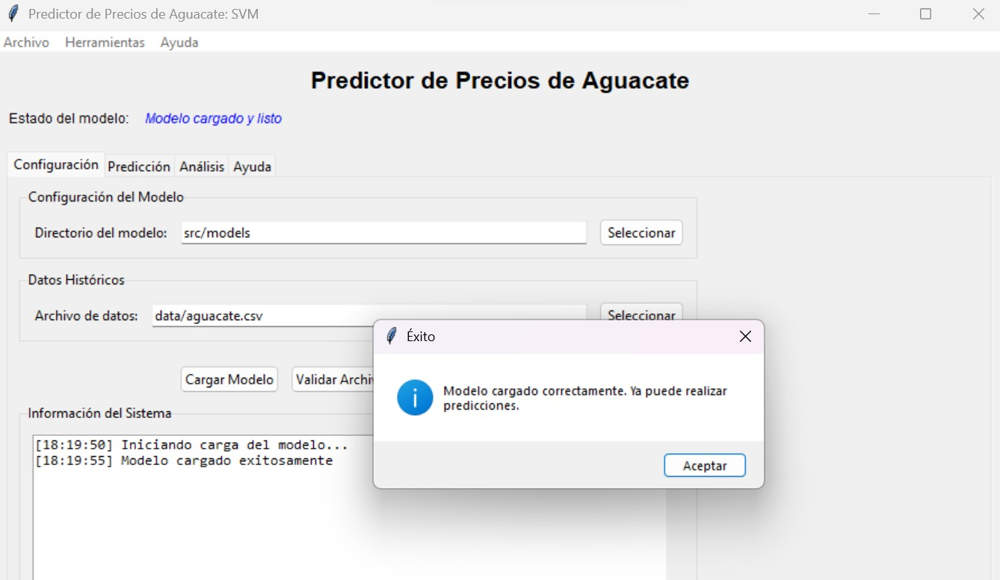

# Predictor de precios de productos de canasta básica

Una aplicación de escritorio desarrollada en Python que predice precios futuros de productos de canasta básica (específicamente aguacate) utilizando un modelo de Support Vector Machine (SVM). La aplicación cuenta con una interfaz gráfica amigable desarrollada en Tkinter que permite realizar predicciones, análisis estadísticos y generar reportes.

## Características principales

- Predicción de precios para fechas específicas usando modelo SVM optimizado
- Análisis estadístico completo de datos históricos
- Interfaz gráfica intuitiva con pestañas organizadas
- Análisis de tendencias y volatilidad de precios
- Exportación de resultados y reportes
- Validación automática de modelos y datos
- Predicciones múltiples para análisis de proyecciones


## Instalación

### Requisitos del sistema

- Python 3.8 o superior
- Sistema operativo: Windows, macOS o Linux

### Dependencias

```bash
pip install -r requirements.txt
```

Las dependencias incluyen:
- numpy >= 1.21.0
- pandas >= 1.3.0
- scikit-learn >= 1.0.0
- matplotlib >= 3.4.0
- seaborn >= 0.11.0
- joblib >= 1.1.0

### Configuración inicial

1. Clona el repositorio:
   ```bash
   git clone https://github.com/tu-usuario/predictor-canasta-basica.git
   cd predictor-canasta-basica
   ```

2. Instala las dependencias:
   ```bash
   pip install -r requirements.txt
   ```

3. Ejecuta la aplicación:
   ```bash
   python -m src.app.main
   ```

## Uso de la aplicación

### Configuración inicial

1. Abre la pestaña "Configuración"
2. Selecciona el directorio que contiene los modelos entrenados (archivos .pkl)
3. Selecciona el archivo CSV con datos históricos
4. Haz clic en "Cargar Modelo"



### Realizar predicciones

1. Ve a la pestaña "Predicción"
2. Ingresa una fecha futura en formato YYYY-MM-DD
3. Usa los botones de acceso rápido para fechas comunes
4. Haz clic en "Predecir Precio"


### Análisis de datos

La pestaña "Análisis" ofrece herramientas para:
- Estadísticas básicas de precios históricos
- Análisis de tendencias por períodos
- Evaluación de volatilidad del mercado


## Estructura del proyecto

```
predictor-canasta-basica/
├── src/
│   ├── app/
│   │   ├── __init__.py
│   │   └── main.py              # Aplicación principal
│   ├── models/
│   │   ├── __init__.py
│   │   └── predictor.py         # Clase PredictorAguacate
│   └── utils/
│       ├── __init__.py
│       └── data_handler.py      # Utilidades de datos
├── data/
│   ├── aguacate.csv            # Datos procesados
│   └── models/                 # Modelos entrenados
│       ├── best_svm_mejorado.pkl
│       ├── scaler_X.pkl
│       ├── scaler_y.pkl
│       └── feature_columns.pkl
├── assets/
│   └── screenshots/            # Capturas de pantalla
├── docs/
│   └── informe.docx      # Detalles de los modelos
├── tests/
│   └── test_app.py           # Pruebas básicas
├── requirements.txt          # Dependencias
└── README.md                # Esta documentación
```

## Funcionamiento del modelo

### Algoritmo utilizado

- **Support Vector Regression (SVR)** con kernel RBF
- Hiperparámetros optimizados mediante validación cruzada
- Características temporales y de lag para capturar estacionalidad

### Características del modelo

El modelo utiliza múltiples tipos de características:
- **Temporales**: Año, mes, día del año, trimestre
- **Cíclicas**: Funciones seno/coseno para estacionalidad
- **Lag**: Precios de períodos anteriores (1, 2, 3 períodos)
- **Medias móviles**: Ventanas de 3 y 6 períodos
- **Volatilidad**: Desviación estándar móvil
- **Diferencias**: Cambios en precios entre períodos

### Métricas de rendimiento

- **R² Score**: 0.997 (coeficiente de determinación)
- **RMSE**: 0.72 (error cuadrático medio)
- **Precisión**: Alta correlación con valores reales

## Datos utilizados

Los datos provienen del archivo original `INP_PP_CAB18.xlsx` que contiene información histórica de precios de productos de canasta básica, procesado y filtrado para el aguacate en el archivo `aguacate.csv`.

El dataset incluye:
- Fechas de publicación en el Diario Oficial de la Federación
- Precios promedio por kilogramo en pesos mexicanos
- Período de datos: 2019-2024

## Funcionalidades adicionales

### Validación automática

La aplicación incluye validación de:
- Archivos del modelo (presencia y formato)
- Datos históricos (columnas requeridas)
- Fechas de predicción (formato y validez)

### Exportación de resultados

- Guarda predicciones y análisis en archivos de texto
- Formato legible para reportes
- Incluye metadatos de la predicción

### Predicciones múltiples

- Genera proyecciones para varios meses
- Análisis de tendencias proyectadas
- Resumen estadístico de predicciones

## Solución de problemas comunes

### Error: "Modelo no cargado"
- Verifica que todos los archivos .pkl estén presentes en el directorio
- Usa "Herramientas > Verificar Modelo" para diagnóstico

### Error: "Formato de fecha inválido"
- Usa el formato exacto YYYY-MM-DD
- Ejemplo: 2024-12-15

### Error: "Archivo de datos no válido"
- Verifica que el CSV tenga las columnas requeridas
- Asegúrate de que el archivo tenga codificación UTF-8

## Desarrollo y contribuciones

### Requisitos para desarrollo

```bash
# Instalar dependencias de desarrollo
pip install -r requirements.txt

# Ejecutar pruebas
python tests/test_app.py
```

### Estructura de código

El código está organizado en módulos:
- `src/app/main.py`: Interfaz gráfica principal
- `src/models/predictor.py`: Lógica del modelo SVM
- `src/utils/data_handler.py`: Utilidades para manejo de datos

## Autor
Clara Victoria García Chávez, como proyecto final del Diplomado en Ciencia de Datos.

## Actualizaciones

- **v1.0** (Septiembre 2025): Versión inicial con modelo SVM y interfaz gráfica completa
